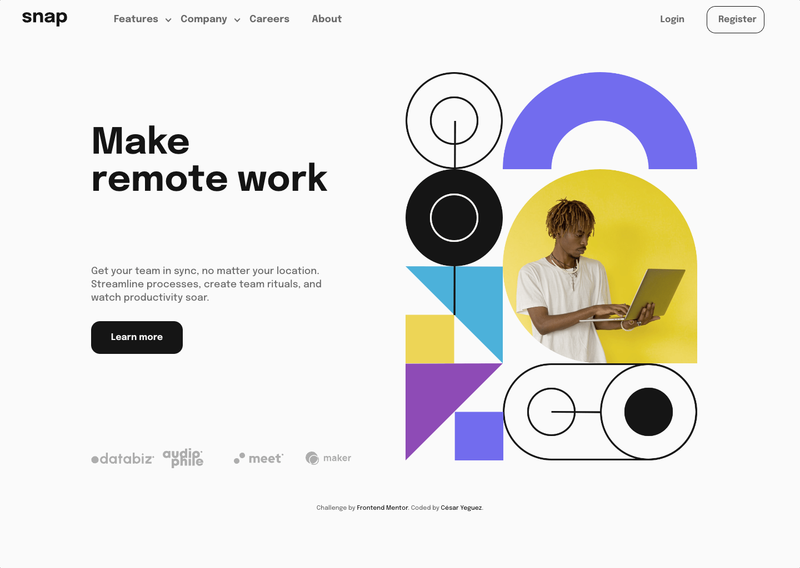

# Frontend Mentor - Intro section with dropdown navigation solution

This is a solution to the [Intro section with dropdown navigation challenge on Frontend Mentor](https://www.frontendmentor.io/challenges/intro-section-with-dropdown-navigation-ryaPetHE5).

## Table of contents

- [The challenge](#the-challenge)
- [Screenshot](#screenshot)
- [Links](#links)
- [My process](#my-process)
  - [Built with](#built-with)
  - [What I learned](#what-i-learned)
- [Author](#author)

**Note: Delete this note and update the table of contents based on what sections you keep.**

### The challenge

Users should be able to:

- View the relevant dropdown menus on desktop and mobile when interacting with the navigation links
- View the optimal layout for the content depending on their device's screen size
- See hover states for all interactive elements on the page

### Screenshot

### Links

## My process

- I configure the project architecture . 🏛️
- I clean the HTML of Comments and styles. 🧹
- I assign the HTML tags. 🎯
- I write the styles, I configure mediaquerys. 🕶️
- I create the logical part in JS. 🧠

### Built with

  

### What I learned

This project forced me to interact in greater depth with SVGs.

## Author

- Website - [GITHUB](https://github.com/cyeguez)
- Frontend Mentor - [@yourusername](https://www.frontendmentor.io/profile/cyeguez)
